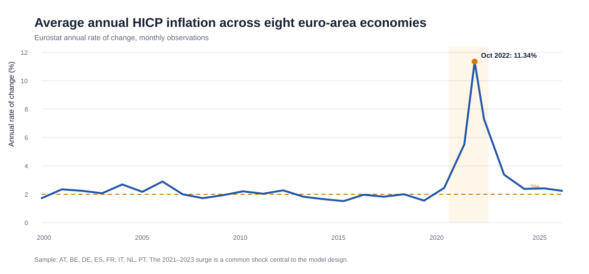
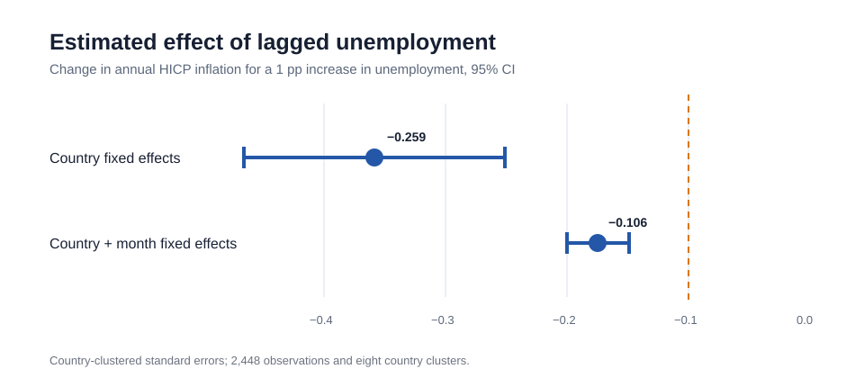

# Eurozone Inflation and Unemployment

[](https://github.com/ermanesen/eurozone-inflation-analysis/actions/workflows/tests.yml)

An auditable panel analysis of annual HICP inflation and unemployment in eight euro-area economies, 2000–2025.



## Research question

Does higher unemployment predict lower inflation within euro-area economies, and how much of that relationship remains after common monthly shocks are absorbed?

The project revisits a Phillips-curve question with two safeguards that materially change the original analysis:

- Eurostat dataset `prc_hicp_manr` already reports the HICP **annual rate of change**. The published rate is therefore used directly; no second `pct_change(12)` transformation is applied.
- Dataset `une_rt_m` is explicitly filtered to the seasonally adjusted total unemployment rate (`s_adj=SA`, `age=TOTAL`, `sex=T`, `unit=PC_ACT`). Every country-month must be unique before merging.

## Main results

The sample contains 2,496 complete country-month observations for Austria, Belgium, Germany, Spain, France, Italy, the Netherlands, and Portugal. A six-month unemployment lag leaves 2,448 model observations.

| Specification | Lagged unemployment coefficient | Clustered SE | p-value | Observations |
|---|---:|---:|---:|---:|
| Country fixed effects | -0.259 | 0.055 | 0.002 | 2,448 |
| Country + month fixed effects | -0.106 | 0.013 | <0.001 | 2,448 |

A one-percentage-point increase in unemployment six months earlier is associated with 0.259 percentage points lower annual HICP inflation in the country fixed-effects model. Absorbing common month shocks attenuates the estimate to 0.106 percentage points, but **does not reverse its sign**.



Across the eight-country sample, average inflation peaked at **11.34% in October 2022**. It averaged **1.46% in 2010–2019**, **5.46% in 2021–2023**, and **2.41% in 2025**.

## Interpretation

The attenuation after month effects shows that common shocks—such as the pandemic reopening and energy-price surge—explain an important part of inflation variation. The remaining negative coefficient is consistent with a within-country Phillips-curve relationship, conditional on country and month effects.

This is an association, not a causal estimate. The regression does not identify an exogenous unemployment shock; only eight country clusters are available; both series are revised by Eurostat; and a single slope can conceal changes across periods and economies.

## Data and quality controls

- **HICP:** Eurostat `prc_hicp_manr`, all-items `CP00`, unit `RCH_A`.
- **Unemployment:** Eurostat `une_rt_m`, `s_adj=SA`, `age=TOTAL`, `sex=T`, `unit=PC_ACT`.
- **Coverage:** 8 countries × 312 months = 2,496 expected rows.
- **Merge policy:** both sources are joined onto the full expected country-month grid; missing combinations remain visible and fail validation.
- **Uniqueness:** duplicate country-month keys fail before the merge.
- **Snapshot:** the processed CSV is committed so the published results remain reproducible when Eurostat revises its live series. Raw downloads are ignored.

The committed snapshot was reconstructed from the project’s original Eurostat extracts while removing repeated seasonal-adjustment variants. Run the refresh command below to replace it with a current API snapshot using the now-explicit filters.

## Reproduce

```bash
python -m venv .venv
python -m pip install -r requirements.txt
python scripts/run_analysis.py
jupyter nbconvert --to notebook --execute --inplace notebooks/eurozone_phillips_curve.ipynb
pytest
```

To download and validate a fresh Eurostat snapshot before rebuilding the outputs:

```bash
python scripts/run_analysis.py --refresh
```

All script messages and logs are in English. Configuration—countries, dates, dataset codes, and lag length—lives in [`config/analysis.toml`](config/analysis.toml), rather than being duplicated across scripts.

## Repository structure

```text
config/                 Analysis scope and Eurostat dataset codes
data/processed/         Versioned analysis snapshot
data/raw/               Ignored live downloads
figures/                Published SVG figures
notebooks/              Executed, narrated analysis
reports/                Full report and result tables
scripts/                Pipeline and notebook entry points
src/eurozone_inflation/ Reusable data, model, and plotting code
tests/                  Data, model, and publication checks
```

## Methods

The outcome is the published annual HICP rate. The explanatory variable is the seasonally adjusted unemployment rate lagged six months within country. Two panel regressions are reported:

1. country fixed effects, which remove time-invariant country differences;
2. country and calendar-month fixed effects, which also absorb shocks common to all eight countries in each month.

Inference uses standard errors clustered by country. With eight clusters, p-values should be treated cautiously; coefficient size, confidence intervals, and robustness matter more than a binary significance label.

See the [full report](reports/final_report.md) and [executed notebook](notebooks/eurozone_phillips_curve.ipynb) for the audit trail.

## License

Code is released under the [MIT License](LICENSE). Eurostat data remain subject to Eurostat’s reuse policy and revision process.
